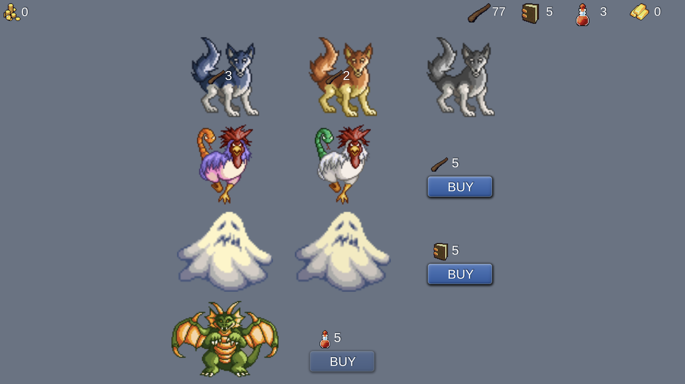
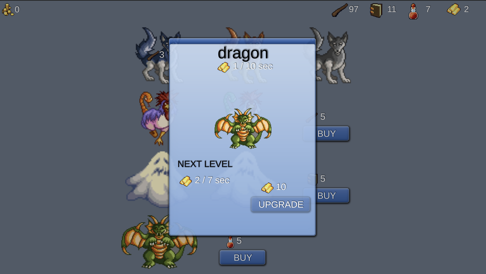

# UniRx Game Sample

## Summary

It's experimental sample for UniRx usage to address complex UI logic problems like value updates, model-view state synchronization and update chains (appear animations before actual value update).

This project is not production ready, it's only proof-of-concept to get experience with a new tools. In practice, UniRx solves many issues, but it isn't silver bullet and in some cases increases code complexity, so it should be used with caution.

## Screenshots

## Features

- Player can buy & upgrade units using resources
- Each type of units produces different type of resources
- Units produces resources each time interval
- Resources accumulates and can be claimed by click
- State persisted between sessions

## Architecture

- **Config** - ScriptableObject for configuration
- **Editor** - utility to clean up current save data
- **Model** - plain data storage for state
- **Service** - JSON serialization for models, time provider
- **Shared** - models, shared between Model and Config layers
- **Tests**
    - **Integration** - tests to cover all logic through View layer
    - **Unit** - isolated tests to cover only serialization and ViewModel layer
- **View** - MonoBehaviour classes, which uses ViewModels to show and update state and pass events into ViewModel layer
- **ViewModel** - wrappers for Model layer with ReactiveProperties to notify about value updates, game logic to manipulate state

## Credits

- https://opengameart.org/content/turning-polyhedron-gui
- https://opengameart.org/content/ascension-adventure-interface-and-miscellaneous
- https://opengameart.org/content/10-fantasy-rpg-enemies